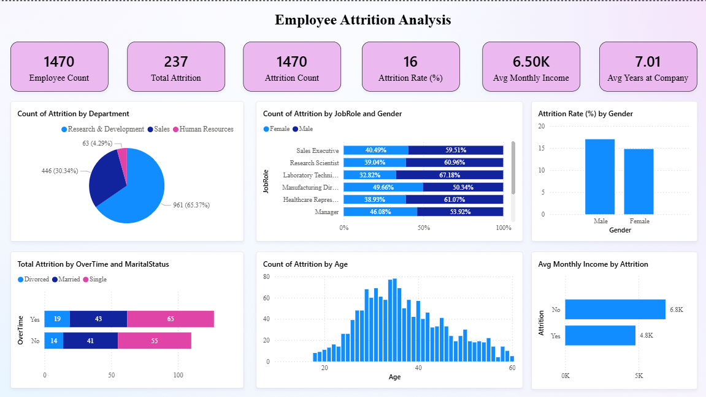

# Employee Attrition Analysis

## 📌 Project Overview
This project analyzes employee attrition and predicts which employees are likely to leave the organization using HR analytics and machine learning.

## 🎯 Objectives
- Identify key factors influencing employee resignation
- Predict attrition using classification models
- Build an interactive Power BI dashboard for HR insights

## 📊 Dataset
IBM HR Analytics Employee Attrition Dataset (Kaggle)

## 🛠 Tools & Technologies
- Python (Pandas, NumPy, Scikit-learn)
- Power BI
- Jupyter Notebook

## 🔍 Key Insights
- Employees working overtime have higher attrition
- Lower salary increases attrition risk
- Younger employees are more likely to leave

## 📈 Dashboard Preview


## 📂 Repository Structure
```text
Employee-Attrition-Analysis/
├── Dashboard image/
├── Power bi file/
├── CSV data files/
├── Jupyter Notebook code/
└── README.md
```


## 📬 Contact
Vinayak Pawate
